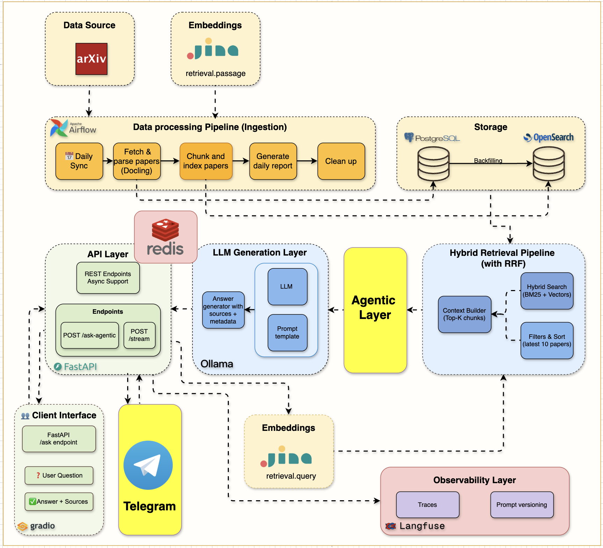
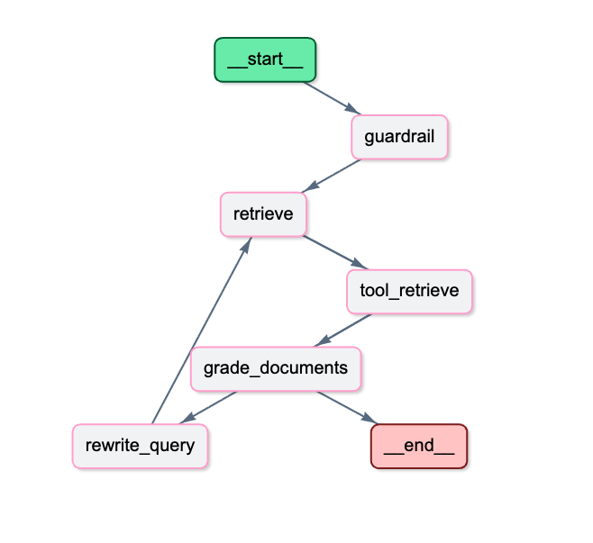

# The Mother of AI Project
## Phase 1 RAG Systems: arXiv Paper Curator

<div align="center">
  <h3>A Learner-Focused Journey into Production RAG Systems</h3>
  <p>Learn to build modern AI systems from the ground up through hands-on implementation</p>
  <p>Master the most in-demand AI engineering skills: <strong>RAG (Retrieval-Augmented Generation)</strong></p>
</div>

<p align="center">
  
  
  
  
  
</p>

</br>

<p align="center">
  <a href="#-about-this-course">
    
  </a>
</p>

## 📖 About This Course

This is a **learner-focused project** where you'll build a complete research assistant system that automatically fetches academic papers, understands their content, and answers your research questions using advanced RAG techniques.

**The arXiv Paper Curator** will teach you to build a **production-grade RAG system using industry best practices**. Unlike tutorials that jump straight to vector search, we follow the **professional path**: master keyword search foundations first, then enhance with vectors for hybrid retrieval.

> **🎯 The Professional Difference:** We build RAG systems the way successful companies do - solid search foundations enhanced with AI, not AI-first approaches that ignore search fundamentals.

By the end of this course, you'll have your own AI research assistant and the deep technical skills to build production RAG systems for any domain.

### **🎓 What You'll Build**

- **Week 1:** Complete infrastructure with Docker, FastAPI, PostgreSQL, OpenSearch, and Airflow
- **Week 2:** Automated data pipeline fetching and parsing academic papers from arXiv  
- **Week 3:** Production BM25 keyword search with filtering and relevance scoring
- **Week 4:** Intelligent chunking + hybrid search combining keywords with semantic understanding
- **Week 5:** **Complete RAG pipeline with local LLM, streaming responses, and Gradio interface**
- **Week 6:** **Production monitoring with Langfuse tracing and Redis caching for optimized performance**
- **Week 7:** **Agentic RAG with LangGraph and Telegram Bot for intelligent reasoning and mobile access**

---

## 🏗️ System Architecture Evolution

### Week 7: Agentic RAG & Telegram Bot Integration
<div align="center">
  
  <p><em>Complete Week 7 architecture showing Telegram bot integration with the agentic RAG system</em></p>
</div>

### LangGraph Agentic RAG Workflow
<div align="center">
  
  <p><em>Detailed LangGraph workflow showing decision nodes, document grading, and adaptive retrieval</em></p>
</div>

**Agentic RAG Workflow:**
```
User Query → Guardrail Node → [PROCEED or OUT_OF_SCOPE]
         ↓
   Retrieve Node (attempt 1)
         ↓
   Grade Documents → [RELEVANT or INSUFFICIENT]
         ↓
   [If INSUFFICIENT] → Rewrite Query → Retrieve Node (attempt 2)
         ↓
   Generate Answer Node → Final Response with Citations
```

**Key Innovations in Week 7:**
- 🤖 **Intelligent Decision-Making**: Agents evaluate and adapt retrieval strategies
- 🔍 **Document Grading**: Automatic relevance assessment with semantic evaluation
- 🔄 **Query Rewriting**: Adaptive query refinement when results are insufficient
- 🛡️ **Guardrails**: Out-of-domain detection prevents hallucination
- 📱 **Mobile Access**: Telegram bot for conversational AI on any device
- 🔎 **Transparency**: Full reasoning step tracking for debugging and trust

---

## 🚀 Quick Start

### **📋 Prerequisites**
- **Docker Desktop** (with Docker Compose)  
- **Python 3.12+**
- **UV Package Manager** ([Install Guide](https://docs.astral.sh/uv/getting-started/installation/))
- **8GB+ RAM** and **20GB+ free disk space**

### **⚡ Get Started**

```bash
# 1. Clone and setup
git clone <repository-url>
cd arxiv-paper-curator

# 2. Configure environment (IMPORTANT!)
cp .env.example .env
# The .env file contains all necessary configuration for OpenSearch, 
# arXiv API, and service connections. Defaults work out of the box.
# For Week 4: Add JINA_API_KEY=your_key_here for hybrid search

# 3. Install dependencies
uv sync

# 4. Start all services
docker compose up --build -d

# 5. Verify everything works
curl http://localhost:8000/health
```

### **📚 Weekly Learning Path**

| Week | Topic | Blog Post | Code Release |
|------|-------|-----------|--------------|
| **Week 0** | The Mother of AI project - 6 phases | [The Mother of AI project](https://jamwithai.substack.com/p/the-mother-of-ai-project) | - |
| **Week 1** | Infrastructure Foundation | [The Infrastructure That Powers RAG Systems](https://jamwithai.substack.com/p/the-infrastructure-that-powers-rag) | [week1.0](https://github.com/jamwithai/arxiv-paper-curator/releases/tag/week1.0) |
| **Week 2** | Data Ingestion Pipeline | [Building Data Ingestion Pipelines for RAG](https://jamwithai.substack.com/p/bringing-your-rag-system-to-life) | [week2.0](https://github.com/jamwithai/arxiv-paper-curator/releases/tag/week2.0) |
| **Week 3** | OpenSearch ingestion & BM25 retrieval | [The Search Foundation Every RAG System Needs](https://jamwithai.substack.com/p/the-search-foundation-every-rag-system) | [week3.0](https://github.com/jamwithai/arxiv-paper-curator/releases/tag/week3.0) |
| **Week 4** | **Chunking & Hybrid Search** | [The Chunking Strategy That Makes Hybrid Search Work](https://jamwithai.substack.com/p/chunking-strategies-and-hybrid-rag) | [week4.0](https://github.com/jamwithai/arxiv-paper-curator/releases/tag/week4.0) |
| **Week 5** | **Complete RAG system** | [The Complete RAG System](https://jamwithai.substack.com/p/the-complete-rag-system) | [week5.0](https://github.com/jamwithai/arxiv-paper-curator/releases/tag/week5.0) |
| **Week 6** | **Production monitoring & caching** | [Production-ready RAG: Monitoring & Caching](https://jamwithai.substack.com/p/production-ready-rag-monitoring-and) | [week6.0](https://github.com/jamwithai/arxiv-paper-curator/releases/tag/week6.0) |
| **Week 7** | **Agentic RAG & Telegram Bot** | [Agentic RAG with LangGraph and Telegram](https://jamwithai.substack.com/p/agentic-rag-with-langgraph-and-telegram) | [week7.0](https://github.com/jamwithai/arxiv-paper-curator/releases/tag/week7.0) |

**📥 Clone a specific week's release:**
```bash
# Clone a specific week's code
git clone --branch <WEEK_TAG> https://github.com/jamwithai/arxiv-paper-curator
cd arxiv-paper-curator
uv sync
docker compose down -v
docker compose up --build -d

# Replace <WEEK_TAG> with: week1.0, week2.0, etc.
```

### **📊 Access Your Services**

| Service | URL | Purpose |
|---------|-----|---------|
| **API Documentation** | http://localhost:8000/docs | Interactive API testing |
| **Gradio RAG Interface** | http://localhost:7861 | User-friendly chat interface |
| **Langfuse Dashboard** | http://localhost:3000 | RAG pipeline monitoring & tracing |
| **Airflow Dashboard** | http://localhost:8080 | Workflow management |
| **OpenSearch Dashboards** | http://localhost:5601 | Hybrid search engine UI |

#### **NOTE**: Check airflow/simple_auth_manager_passwords.json.generated for Airflow username and password
---

## 📚 Week 1: Infrastructure Foundation ✅

**Start here!** Master the infrastructure that powers modern RAG systems.

### **🎯 Learning Objectives**
- Complete infrastructure setup with Docker Compose
- FastAPI development with automatic documentation and health checks
- PostgreSQL database configuration and management
- OpenSearch hybrid search engine setup
- Ollama local LLM service configuration
- Service orchestration and health monitoring
- Professional development environment with code quality tools

### **🏗️ Architecture Overview**

<p align="center">
  
</p>

**Infrastructure Components:**
- **FastAPI**: REST endpoints with async support (Port 8000)  
- **PostgreSQL 16**: Paper metadata storage (Port 5432)
- **OpenSearch 2.19**: Search engine with dashboards (Ports 9200, 5601)
- **Apache Airflow 3.0**: Workflow orchestration (Port 8080)
- **Ollama**: Local LLM server (Port 11434)

### **📓 Setup Guide**

```bash
# Launch the Week 1 notebook
uv run jupyter notebook notebooks/week1/week1_setup.ipynb
```

**Completion Guide:** Follow the [Week 1 notebook](notebooks/week1/week1_setup.ipynb) for hands-on setup and verification steps.

### **📖 Deep Dive**
**Blog Post:** [The Infrastructure That Powers RAG Systems](https://jamwithai.substack.com/p/the-infrastructure-that-powers-rag) - Detailed walkthrough and production insights

---

## 📚 Week 2: Data Ingestion Pipeline ✅

**Building on Week 1 infrastructure:** Learn to fetch, process, and store academic papers automatically.

### **🎯 Learning Objectives**
- arXiv API integration with rate limiting and retry logic
- Scientific PDF parsing using Docling
- Automated data ingestion pipelines with Apache Airflow
- Metadata extraction and storage workflows
- Complete paper processing from API to database

### **🏗️ Architecture Overview**

<p align="center">
  
</p>

**Data Pipeline Components:**
- **MetadataFetcher**: 🎯 Main orchestrator coordinating the entire pipeline
- **ArxivClient**: Rate-limited paper fetching with retry logic
- **PDFParserService**: Docling-powered scientific document processing  
- **Airflow DAGs**: Automated daily paper ingestion workflows
- **PostgreSQL Storage**: Structured paper metadata and content

### **📓 Implementation Guide**

```bash
# Launch the Week 2 notebook  
uv run jupyter notebook notebooks/week2/week2_arxiv_integration.ipynb
```

**Completion Guide:** Follow the [Week 2 notebook](notebooks/week2/week2_arxiv_integration.ipynb) for hands-on implementation and verification steps.

### **📖 Deep Dive**
**Blog Post:** [Building Data Ingestion Pipelines for RAG](https://jamwithai.substack.com/p/bringing-your-rag-system-to-life) - arXiv API integration and PDF processing

---

## 📚 Week 3: Keyword Search First - The Critical Foundation

**Building on Weeks 1-2 foundation:** Implement the keyword search foundation that professional RAG systems rely on.

### **🎯 Learning Objectives**
- Why keyword search is essential for RAG systems (foundation first approach)
- OpenSearch index management, mappings, and search optimization
- BM25 algorithm and the math behind effective keyword search
- Query DSL for building complex search queries with filters and boosting
- Search analytics for measuring relevance and performance
- Production patterns used by real companies

### **🏗️ Architecture Overview**

<p align="center">
  
</p>

**Search Infrastructure Components:**
- **OpenSearch Service**: `src/services/opensearch/` - Professional search service implementation
- **Search API**: `src/routers/search.py` - Search API endpoints with BM25 scoring
- **Learning Materials**: `notebooks/week3/` - Complete OpenSearch integration guide
- **Quality Metrics**: Precision, recall, and relevance scoring

### **📓 Setup Guide**

```bash
# Launch the Week 3 notebook
uv run jupyter notebook notebooks/week3/week3_opensearch.ipynb
```

**Completion Guide:** Follow the [Week 3 notebook](notebooks/week3/week3_opensearch.ipynb) for hands-on OpenSearch setup and BM25 search implementation.

### **📖 Deep Dive**
**Blog Post:** [The Search Foundation Every RAG System Needs](https://jamwithai.substack.com/p/the-search-foundation-every-rag-system) - Complete BM25 implementation with OpenSearch

---

## 📚 Week 4: Chunking & Hybrid Search - The Semantic Layer

**Building on Week 3 foundation:** Add the semantic layer that makes search truly intelligent.

### **🎯 Learning Objectives**
- Section-based chunking with intelligent document segmentation
- Production embeddings with Jina AI integration and fallback strategies
- Hybrid search mastery using RRF fusion for keyword + semantic retrieval
- Unified API design with single endpoint supporting multiple search modes
- Performance analysis and trade-offs between search approaches

### **🏗️ Architecture Overview**

<p align="center">
  
</p>

**Hybrid Search Infrastructure Components:**
- **Text Chunker**: `src/services/indexing/text_chunker.py` - Section-aware chunking with overlap strategies
- **Embeddings Service**: `src/services/embeddings/` - Production embedding pipeline with Jina AI
- **Hybrid Search API**: `src/routers/hybrid_search.py` - Unified search API supporting all modes
- **Learning Materials**: `notebooks/week4/` - Complete hybrid search implementation guide

### **📓 Setup Guide**

```bash
# Launch the Week 4 notebook
uv run jupyter notebook notebooks/week4/week4_hybrid_search.ipynb
```

**Completion Guide:** Follow the [Week 4 notebook](notebooks/week4/week4_hybrid_search.ipynb) for hands-on implementation and verification steps.

### **📖 Deep Dive**
**Blog Post:** [The Chunking Strategy That Makes Hybrid Search Work](https://jamwithai.substack.com/p/chunking-strategies-and-hybrid-rag) - Production chunking and RRF fusion implementation

---

## 📚 Week 5: Complete RAG Pipeline with LLM Integration

**Building on Week 4 hybrid search:** Add the LLM layer that turns search into intelligent conversation.

### **🎯 Learning Objectives**
- Local LLM integration with Ollama for complete data privacy
- Performance optimization with 80% prompt reduction (6x speed improvement)
- Streaming implementation using Server-Sent Events for real-time responses
- Dual API design with standard and streaming endpoints
- Interactive Gradio interface with advanced parameter controls

### **🏗️ Architecture Overview**

<p align="center">
  
</p>

**Complete RAG Infrastructure Components:**
- **RAG Endpoints**: `src/routers/ask.py` - Dual endpoints (`/api/v1/ask` + `/api/v1/stream`)
- **Ollama Service**: `src/services/ollama/` - LLM client with optimized prompts
- **System Prompt**: `src/services/ollama/prompts/rag_system.txt` - Optimized for academic papers
- **Gradio Interface**: `src/gradio_app.py` - Interactive web UI with streaming support
- **Launcher Script**: `gradio_launcher.py` - Easy-launch script (runs on port 7861)

### **📓 Setup Guide**

```bash
# Launch the Week 5 notebook
uv run jupyter notebook notebooks/week5/week5_complete_rag_system.ipynb

# Launch Gradio interface
uv run python gradio_launcher.py
# Open http://localhost:7861
```

**Completion Guide:** Follow the [Week 5 notebook](notebooks/week5/week5_complete_rag_system.ipynb) for hands-on LLM integration and RAG pipeline implementation.

### **📖 Deep Dive**
**Blog Post:** [The Complete RAG System](https://jamwithai.substack.com/p/the-complete-rag-system) - Complete RAG system with local LLM integration and optimization techniques

---

## 📚 Week 6: Production Monitoring and Caching

**Building on Week 5 complete RAG system:** Add observability, performance optimization, and production-grade monitoring.

### **🎯 Learning Objectives**
- Langfuse integration for end-to-end RAG pipeline tracing
- Redis caching strategy with intelligent cache keys and TTL management
- Performance monitoring with real-time dashboards for latency and costs
- Production patterns for observability and optimization
- Cost analysis and LLM usage optimization (150-400x speedup with caching)

### **🏗️ Architecture Overview**

<p align="center">
  
</p>

**Production Infrastructure Components:**
- **Langfuse Service**: `src/services/langfuse/` - Complete tracing integration with RAG-specific metrics
- **Cache Service**: `src/services/cache/` - Redis client with exact-match caching and graceful fallback
- **Updated Endpoints**: `src/routers/ask.py` - Integrated tracing and caching middleware
- **Docker Config**: `docker-compose.yml` - Added Redis service and Langfuse local instance
- **Learning Materials**: `notebooks/week6/` - Complete monitoring and caching implementation guide

### **📓 Setup Guide**

```bash
# Launch the Week 6 notebook
uv run jupyter notebook notebooks/week6/week6_cache_testing.ipynb
```

**Completion Guide:** Follow the [Week 6 notebook](notebooks/week6/week6_cache_testing.ipynb) for hands-on Langfuse tracing and Redis caching implementation.

### **📖 Deep Dive**
**Blog Post:** [Production-ready RAG: Monitoring & Caching](https://jamwithai.substack.com/p/production-ready-rag-monitoring-and) - Production-ready RAG with monitoring and caching

---

## 📚 Week 7: Agentic RAG with LangGraph and Telegram Bot

**Building on Week 6 production system:** Add intelligent reasoning, multi-step decision-making, and Telegram bot integration for mobile-first AI interactions.

### **🎯 Learning Objectives**
- LangGraph workflows for state-based agent orchestration with decision nodes
- Guardrail implementation for query validation and domain boundary detection
- Document grading with semantic relevance evaluation
- Query rewriting for automatic query refinement and better retrieval
- Adaptive retrieval with multi-attempt retrieval and intelligent fallback
- Telegram bot integration with async operations and error handling
- Reasoning transparency by exposing agent decision-making process

### **🏗️ Architecture Overview**

<p align="center">
  
</p>

**Agentic RAG Infrastructure Components:**
- **Agent Nodes**: `src/services/agents/nodes/` - Guardrail, retrieve, grade, rewrite, and generate nodes
- **Workflow Orchestration**: `src/services/agents/agentic_rag.py` - LangGraph workflow coordination
- **Telegram Bot**: `src/services/telegram/` - Command handlers and message processing
- **Agentic Endpoint**: `src/routers/agentic_ask.py` - Agentic RAG API endpoint
- **Learning Materials**: `notebooks/week7/` - Week 7 learning materials and examples

### **📓 Setup Guide**

```bash
# Launch the Week 7 notebook
uv run jupyter notebook notebooks/week7/week7_agentic_rag.ipynb
```

**Completion Guide:** Follow the [Week 7 notebook](notebooks/week7/week7_agentic_rag.ipynb) for hands-on LangGraph agentic RAG and Telegram bot implementation.

### **📖 Deep Dive**
**Blog Post:** [Agentic RAG with LangGraph and Telegram](https://jamwithai.substack.com/p/agentic-rag-with-langgraph-and-telegram) - Building intelligent agents with decision-making, adaptive retrieval, and mobile access

---

## ⚙️ Configuration

**Setup:**
```bash
cp .env.example .env
# Edit .env for your environment
```

**Key Variables:**
- `JINA_API_KEY` - Required for Week 4+ (hybrid search with embeddings)
- `TELEGRAM__BOT_TOKEN` - Required for Week 7 (Telegram bot integration)
- `LANGFUSE__PUBLIC_KEY` & `LANGFUSE__SECRET_KEY` - Optional for Week 6 (monitoring)

**Complete Configuration:** See [.env.example](.env.example) for all available options and detailed documentation.

---

## 🔧 Reference & Development Guide

### **🛠️ Technology Stack**

| Service | Purpose | Status |
|---------|---------|--------|
| **FastAPI** | REST API with automatic docs | ✅ Ready |
| **PostgreSQL 16** | Paper metadata and content storage | ✅ Ready |
| **OpenSearch 2.19** | Hybrid search engine (BM25 + Vector) | ✅ Ready |
| **Apache Airflow 3.0** | Workflow automation | ✅ Ready |
| **Jina AI** | Embedding generation (Week 4) | ✅ Ready |
| **Ollama** | Local LLM serving (Week 5) | ✅ Ready |
| **Redis** | High-performance caching (Week 6) | ✅ Ready |
| **Langfuse** | RAG pipeline observability (Week 6) | ✅ Ready |

**Development Tools:** UV, Ruff, MyPy, Pytest, Docker Compose

### **🏗️ Project Structure**

```
arxiv-paper-curator/
├── src/                    # Main application code
│   ├── routers/            # API endpoints (search, ask, papers)
│   ├── services/           # Business logic (opensearch, ollama, agents, cache)
│   ├── models/             # Database models (SQLAlchemy)
│   ├── schemas/            # Pydantic validation schemas
│   └── config.py           # Environment configuration
├── notebooks/              # Weekly learning materials (week1-7)
├── airflow/                # Workflow orchestration (DAGs)
├── tests/                  # Test suite
└── compose.yml             # Docker service orchestration
```

### **📡 API Endpoints Reference**

| Endpoint | Method | Description | Week |
|----------|--------|-------------|------|
| `/health` | GET | Service health check | Week 1 |
| `/api/v1/papers` | GET | List stored papers | Week 2 |
| `/api/v1/papers/{id}` | GET | Get specific paper | Week 2 |
| `/api/v1/search` | POST | BM25 keyword search | Week 3 |
| `/api/v1/hybrid-search/` | POST | Hybrid search (BM25 + Vector) | **Week 4** |

**API Documentation:** Visit http://localhost:8000/docs for interactive API explorer

### **🔧 Essential Commands**

#### **Using the Makefile** (Recommended)
```bash
# View all available commands
make help

# Quick workflow
make start         # Start all services
make health        # Check all services health
make test          # Run tests
make stop          # Stop services
```

#### **All Available Commands**
| Command | Description |
|---------|-------------|
| `make start` | Start all services |
| `make stop` | Stop all services |
| `make restart` | Restart all services |
| `make status` | Show service status |
| `make logs` | Show service logs |
| `make health` | Check all services health |
| `make setup` | Install Python dependencies |
| `make format` | Format code |
| `make lint` | Lint and type check |
| `make test` | Run tests |
| `make test-cov` | Run tests with coverage |
| `make clean` | Clean up everything |

#### **Direct Commands** (Alternative)
```bash
# If you prefer using commands directly
docker compose up --build -d    # Start services
docker compose ps               # Check status
docker compose logs            # View logs
uv run pytest                 # Run tests
```

### **🎓 Target Audience**
| Who | Why |
|-----|-----|
| **AI/ML Engineers** | Learn production RAG architecture beyond tutorials |
| **Software Engineers** | Build end-to-end AI applications with best practices |
| **Data Scientists** | Implement production AI systems using modern tools |

---

## 🛠️ Troubleshooting

**Common Issues:**
- **Services not starting?** Wait 2-3 minutes, check `docker compose logs`
- **Port conflicts?** Stop other services using ports 8000, 8080, 5432, 9200
- **Memory issues?** Increase Docker Desktop memory allocation

**Get Help:**
- Check the comprehensive Week 1 notebook troubleshooting section
- Review service logs: `docker compose logs [service-name]`
- Complete reset: `docker compose down --volumes && docker compose up --build -d`

---

## 💰 Cost Structure

**This course is completely free!** You'll only need minimal costs for optional services:
- **Local Development:** $0 (everything runs locally)
- **Optional Cloud APIs:** ~$2-5 for external LLM services (if chosen)

---

<div align="center">
  <h3>🎉 Ready to Start Your AI Engineering Journey?</h3>
  <p><strong>Begin with the Week 1 setup notebook and build your first production RAG system!</strong></p>
  
  <p><em>For learners who want to master modern AI engineering</em></p>
  <p><strong>Built with love by Jam With AI</strong></p>
</div>

---

## 📄 License

MIT License - see [LICENSE](LICENSE) file for details.
